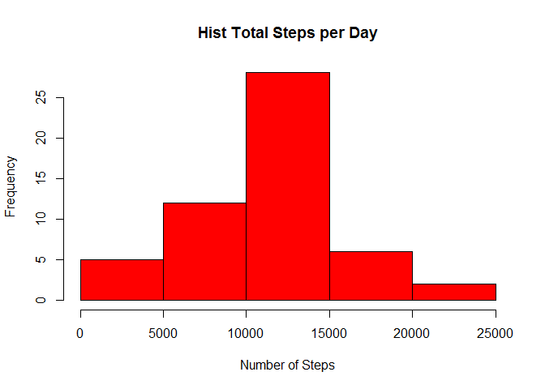
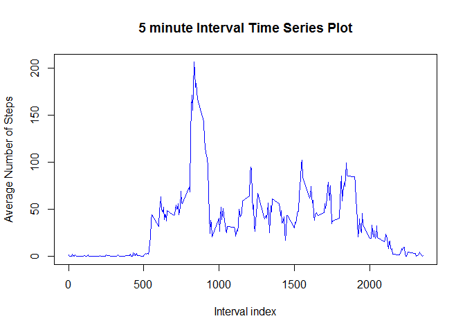
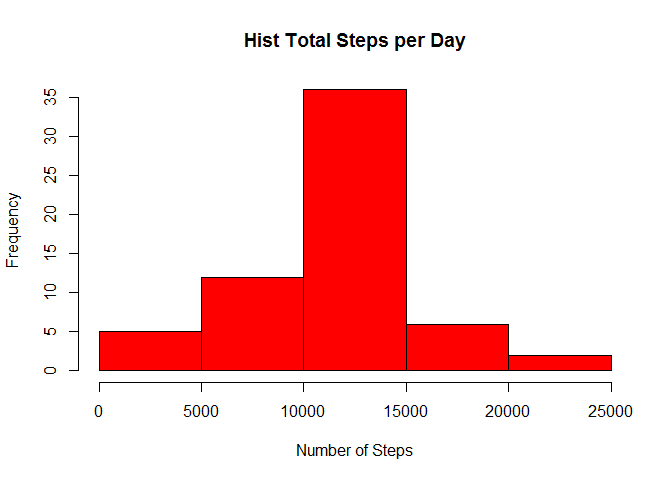
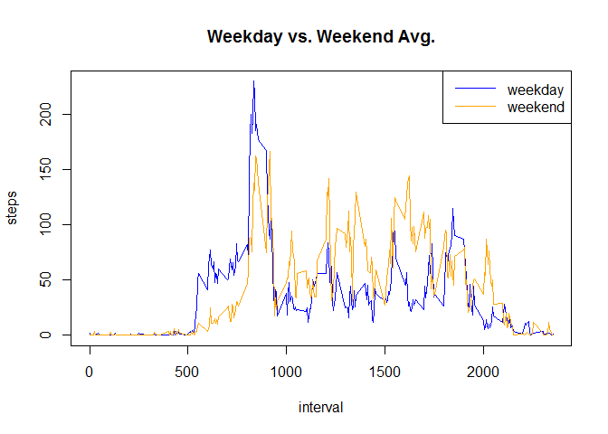

# Reproducible Research: Peer Assessment 1


## Loading and preprocessing the data
- R Code for Loading Data and the required packages:  


```r
library(data.table)
```

```
## Warning: package 'data.table' was built under R version 3.1.3
```

```r
activity <- read.csv("C:/Users/arpita/Desktop/coursera/reproducible_research/RepData_PeerAssessment1/activity.csv")  
```

- Code for Preprocessing the data to include only complete cases, i.e. Omit all NA's


```r
activity2<-subset(activity,complete.cases(activity)==TRUE)  
```


## What is mean total number of steps taken per day?
- R code for finding mean and median of steps taken in a day and plotting a histogram of steps taken each day


```r
activity3 <- as.data.table(activity2)           # convert data.frame to data.table
total_steps_day <- activity3[,sum(steps,na.rm= TRUE),by=date]
hist(total_steps_day$V1,col="red",main="Hist Total Steps per Day", xlab="Number of Steps")
```

 

The mean number of steps in a day is:


```r
mean(total_steps_day$V1)
```

```
## [1] 10766.19
```

The median number of steps in a day is:


```r
median(total_steps_day$V1)
```

```
## [1] 10765
```

## What is the average daily activity pattern?
- R code for computing mean number of steps taken during each interval of the day and making a time series plot of the same.


```r
avg_interval <- activity3[,mean(steps,na.rm= TRUE),by=interval]
plot(avg_interval, type="l", main="5 minute Interval Time Series Plot", ylab="Average Number of Steps", xlab="Interval index", col="blue")
```

 

The Interval Index with maximum number of steps taken during the day is:


```r
avg_interval[V1==max(avg_interval$V1)]$interval
```

```
## [1] 835
```

## Imputing missing values
- R code for reporting the number of missing values and then imputing then missing values by replacing them by mean number of steps taken during that 5 minute interval after rounding it off.
Number of missing values in the dataset are:


```r
nrow(subset(activity,complete.cases(activity)==FALSE))
```

```
## [1] 2304
```

```r
activity4 <- activity
for(i in 1:nrow(activity))
{ 
  if(is.na(activity[i,]$steps)== TRUE)
  {
    activity4[i,]$steps=round(avg_interval[interval==activity[i,]$interval]$V1)
  }
}
```

- Observing changes in histogram, mean and median for imputed dataset.


```r
activity5 <- as.data.table(activity4)           # convert data.frame to data.table
total_steps_day2 <- activity5[,sum(steps,na.rm= TRUE),by=date]
hist(total_steps_day2$V1,col="red",main="Hist Total Steps per Day", xlab="Number of Steps")
```

 

The mean number of steps in a day is: 


```r
mean(total_steps_day2$V1)
```

```
## [1] 10765.64
```

The median number of steps in a day is:


```r
median(total_steps_day2$V1)
```

```
## [1] 10762
```

## Are there differences in activity patterns between weekdays and weekends?
- R code to study differences in patterns of walking during weekdays and weekends by making a time series plot to study the same.


```r
activity6 <- activity4
activity6$date <- as.Date(strptime(activity6$date, format="%Y-%m-%d"))  
activity6$day <- weekdays(activity6$date)                                
for (i in 1:nrow(activity6)) 
  {                                      
  if (activity6[i,]$day %in% c("Saturday","Sunday")) 
    {            
    activity6[i,]$day<-"weekend"                                
     }
  else
    {
    activity6[i,]$day<-"weekday"                                
    }
  }


stepsByDay <- aggregate(activity6$steps ~ activity6$interval + activity6$day, activity6, mean)
names(stepsByDay) <- c("interval", "day", "steps")
par(mfrow=c(1,1))  
with(stepsByDay, plot(steps ~ interval, type="n", main="Weekday vs. Weekend Avg."))  
with(stepsByDay[stepsByDay$day == "weekday",], lines(steps ~ interval, type="l", col="blue"))  
with(stepsByDay[stepsByDay$day == "weekend",], lines(steps ~ interval, type="l", col="orange" ))  
legend("topright", lty=c(1,1), col = c("blue", "orange"), legend = c("weekday", "weekend"), seg.len=3)
```

 
